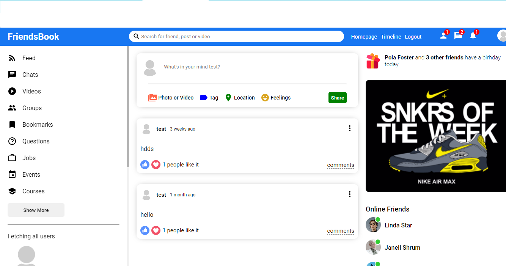
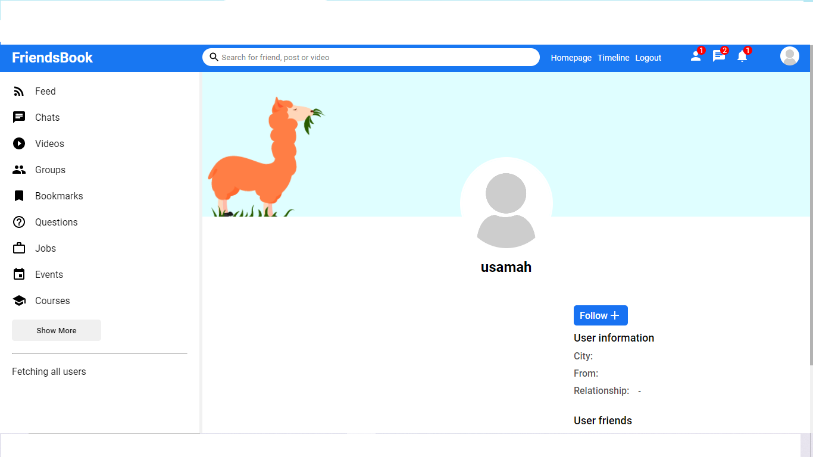

# 💻 Tech Stack:
       

# Introduction
In this project, we will be building a social media app using the MERN stack (MongoDB, Express.js, React, and Node.js) with the Morgan middleware for logging HTTP requests, and with posting and following functionality. The app will allow users to register, log in, create, read, and follow other users.
# Register page

 
 # Home page

# Profile Page

# Follow fuctionality

# fetching all users

